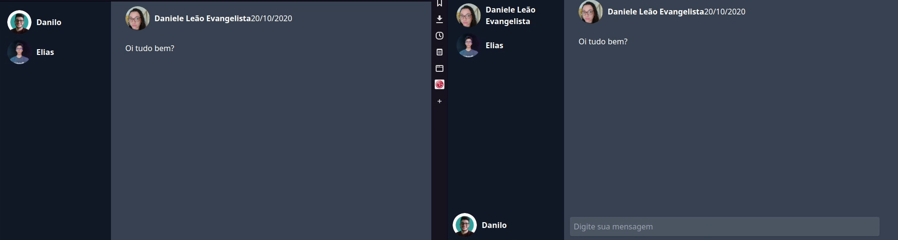

<h1 align="center">
	
</h1>

<h3 align="center">
  Rocketsocket
</h3>

<p align="center">
  <a href="#-about-the-project">About the project</a>&nbsp;&nbsp;&nbsp;|&nbsp;&nbsp;&nbsp;
  <a href="#-technologies">Technologies</a>&nbsp;&nbsp;&nbsp;|&nbsp;&nbsp;&nbsp;
  <a href="#-getting-started">Getting started</a>&nbsp;&nbsp;&nbsp;|&nbsp;&nbsp;&nbsp;
  <a href="#-license">License</a>&nbsp;&nbsp;&nbsp;|&nbsp;&nbsp;&nbsp;
</p>


## 📜 About the project

_"The objective of this project is to exercise some Websocket concepts"._



---
## 🚀 Technologies

Technologies that we used to develop this api

- [NodeJs](https://nodejs.org/en/)
- [Typescript](https://www.typescriptlang.org/)
- [Socket.io](https://socket.io/)
- [Express](https://expressjs.com/pt-br/)
- [MongoDB](https://www.mongodb.com/pt-br)
- [Mongoose](https://mongoosejs.com/)

## 💻 Getting started

### Requirements

Clone the repo using

```bash
git clone https://github.com/HarrisonHenri/rocketsocket.git
```

```bash
cd rocketsocket
```

Run the application (needs docker and docker-compose)

```bash
make build
```

---
## 📝 License

The [MIT License](https://opensource.org/licenses/MIT) - Use freely, I am not responsible for the actions of third parties.

©️ Copyright? 2020 - Rocketsocket - Intellectual property does not exist! Copying Is Not Theft.

[⬆ Back to the top](#-about-the-project)
